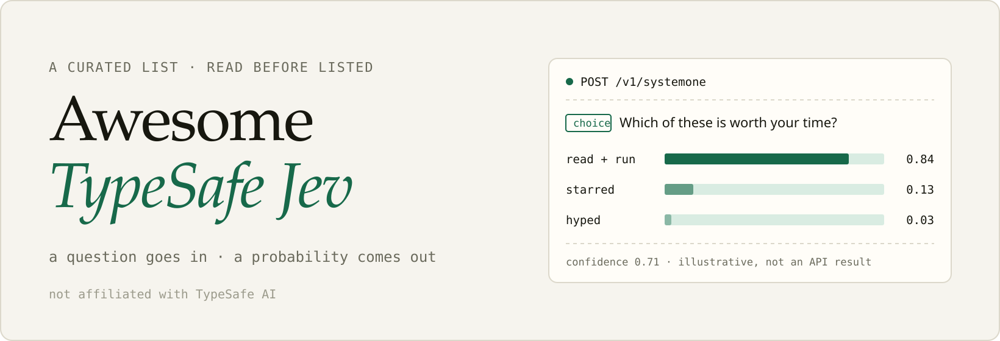
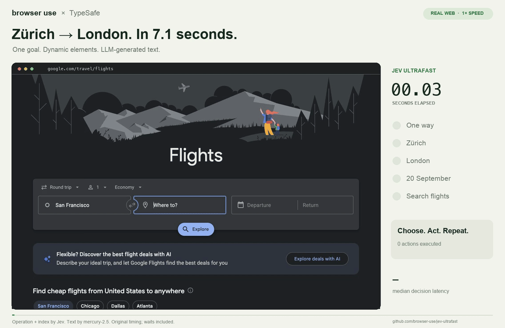
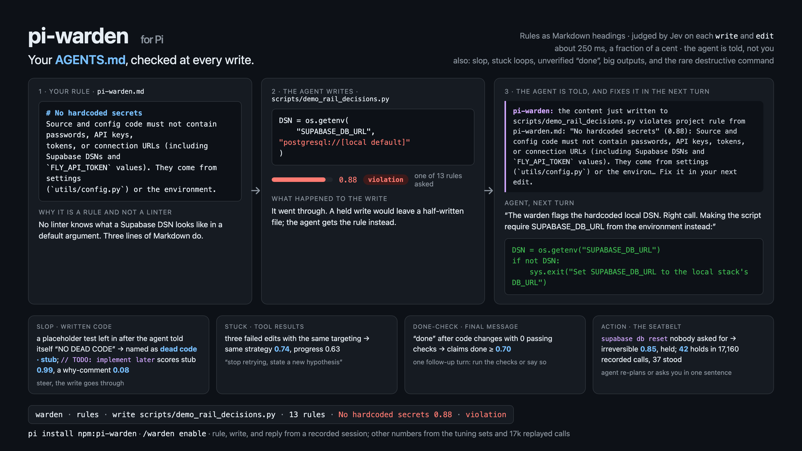
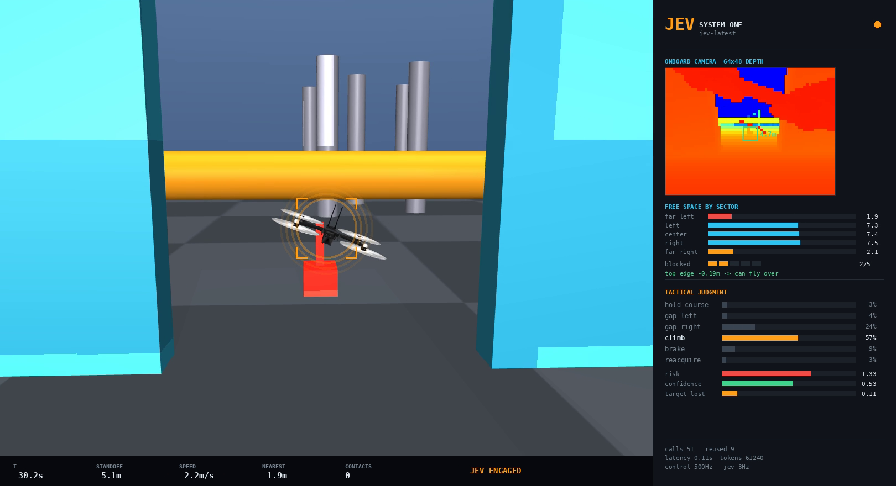
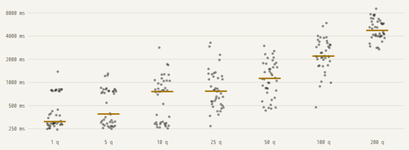

<!-- Rendered from data/entries.json by scripts/render.mjs. Edit the data, not this file. -->
# Awesome TypeSafe Jev 

  

A curated list of projects built on [Jev](https://typesafe.ai), TypeSafe AI's System One model. Jev does not write text. You send a `state` and typed questions (Choice, Score, Noul) and get probabilities back.

**35 entries, 15 picks, every one read before it was listed.** Bigger lists exist and are linked [below](#other-lists). This one is short on purpose: of 329 catalogued repos, 69 were read in full and 35 made it.

**[Browse the site](https://thevibeworks.github.io/awesome-typesafe-jev/)** for media, filters and search. The data is one file: [`data/entries.json`](data/entries.json).

Not affiliated with TypeSafe AI.

## Contents

- [Browser and computer use](#browser-and-computer-use)
- [Agent tooling](#agent-tooling)
- [Games and control](#games-and-control)
- [Benchmarks and research](#benchmarks-and-research)
- [Applications and demos](#applications-and-demos)
- [Official](#official)
- [SDKs and integrations](#sdks-and-integrations)
- [Measured by us](#measured-by-us)
- [Other lists](#other-lists)
- [How entries get in](#how-entries-get-in)
- [Contributing](#contributing)

## Browser and computer use

Agents that click and type, with Jev making each step's decision.

### [jev-ultrafast](https://github.com/browser-use/jev-ultrafast)

Media: browser-use/jev-ultrafast (MIT)

Browser agent where one Jev request picks both the operation and the target element from an indexed DOM table, with a small LLM writing typed text.

**Why it is here:** 1x demo GIF/MP4 of a Google Flights search, README claims 7,073 ms for that run and a median 9.450 s to 7.092 s across six alternating runs with stated measurement boundaries, plus uv setup, library API and offline tests.

**Know before you use it:** Timings are three repeats of one task on one browser profile, and it needs a second paid key for the text model.

MIT · Python

### [turbo](https://github.com/sightmap/jev-turbo)

Media: sightmap/turbo (MIT)

Go CLI that turns a page into named sightmap components and has Jev pick the next action and judge goal completion, with no large model in the loop.

**Why it is here:** npm and go install lines, a real step log with per-phase timings, a 1x demo GIF, and README claims 10/10 goals on two sites at 0.24 to 0.30 s a step versus Claude Sonnet in the same seat, with run files in bench/.

**Know before you use it:** Goals are 2 to 12 steps on cooperative sites, and typed values must be supplied by the user or an optional Claude planning call.

MIT · Go

### [jev-browse](https://github.com/kyrylosyzonenko/jev-browse)

Media: kyrylosyzonenko/jev-browse (MIT)

CLI and MCP server where Jev picks every click, which supplied text to type, and when to stop, with Vercel agent-browser executing the actions.

**Why it is here:** Demo GIF of a full checkout flow, runs via npx, exit codes, stated limits; README claims 30/30 passes at 4.4 s median and $0.0009 per task vs Claude Code 30/30 at 9.4 s and $0.0679 on the same 10 tasks x 3 runs, with a rerunnable eval.mjs.

**Know before you use it:** Ten short tasks only, and it sends page content and any supplied password to the API on every step.

MIT · JavaScript

### [mobile-jev](https://github.com/droidrun/mobile-jev)

Android phone agent on the Mobilerun API where Jev chooses each tap, type, scroll, or app launch, with a React studio, CLI, and execution traces.

**Why it is here:** Demo GIF of Uber navigation (README claims about 21 seconds for 9 actions and says no booking was completed), a dark-theme demo that re-reads the switch to verify, and `pnpm check` CI.

**Know before you use it:** Requires a paid Mobilerun device and key, so it is not reproducible without that vendor's service.

MIT · JavaScript

- [typesafe-computer-use](https://github.com/awlevin/typesafe-computer-use) - macOS computer-use loop: OCR plus accessibility tree become a numbered item list, Jev picks action and target, a writer model handles free text only. MIT · Python
- [jev-browser](https://github.com/Ying-Kai-Liao/jev-browser) - Playwright library, CLI, and MCP server where the calling LLM names one outcome per step and Jev picks element, action, and done/blocked/irreversible status. MIT · JavaScript
- [jev-mobile](https://github.com/Friedjof/jev-mobile) - Android control loop where Jev picks one action from a prevalidated list built from the UI tree, run through Mobile MCP or a bundled accessibility bridge. MIT · Python

## Agent tooling

Routers, guardrails, verifiers and harness parts built on typed answers.

### [pi-warden](https://github.com/DevMortimer/pi-warden)

Media: DevMortimer/pi-warden (MIT)

Guardrail extension for the Pi coding agent: Jev judges each write/edit/bash call against project rules and steers the agent instead of prompting the user.

**Why it is here:** README claims a paired A/B eval (150 headless runs: 6 rule violations with it off, 0 on) with a separate mechanical checker, a replay of 17,160 guarded calls from 321 sessions, 185 offline tests, and publishes the axes where it showed no effect.

**Know before you use it:** Only works inside Pi, the benchmark lives in the same repo as the tool, and sample sizes are small (15 tasks, two models) by the author's own admission.

MIT · TypeScript

### [pi-jev](https://github.com/y0usaf/pi-jev)

Pi coding agent extension that gates bash/write/edit calls with four Jev questions, judges bash output for secrets and failure class, and adds a jev_ask tool.

**Why it is here:** One-line `pi install`, full config reference, and calibration tables; README claims 53 output fixtures run three times each (203 requests, 0 failures, 126 ms median) and documents a rejected question wording with its scores.

**Know before you use it:** Gate thresholds rest on six states with a handful of runs each, which the README itself calls a smoke calibration, so enforce mode is off by default.

MIT · TypeScript

### [winnow](https://github.com/GhalebDweikat/winnow)

Claude Code plugin that asks Jev per block whether a large Read/Bash/Grep result is needed, and replaces confident-no blocks with a recallable stub.

**Why it is here:** Plugin install commands, a keyless `winnow demo --fake`, shadow mode, pytest + plugin tests with a CI badge, and an offline replay harness; README claims results on 300 real cases with 97 blind hand labels and 16 ms sidecar hook overhead.

**Know before you use it:** The measured numbers live in docs/DESIGN.md rather than the README, and the weak-label regret is by its own admission an upper bound from one person's sessions.

MIT · Python

### [jev-axi](https://github.com/shiftynick/jev-axi)

CLI for agents and scripts: pick/rate/check/rank/filter, diff review, log triage, injection guard, pre-tool-use safety hook, git hooks, GitHub Action.

**Why it is here:** Published on npm with CI, real command output, a local cache and usage ledger; README claims the safety hook blocks 18/18 harmful of 44 labeled tool calls (bench/cases/safety.yaml) and reports a negative result: 25% fewer files read but same cost on a 390k-line repo.

**Know before you use it:** Very broad surface for a days-old tool, and the safety benchmark is a small self-labeled set.

MIT · TypeScript

### [jev-router](https://github.com/gargpratyush/jev-router)

Media: gargpratyush/jev-router (MIT)

Loopback proxy that launches Claude Code or Codex and uses one Jev call per user turn to pick the model tier, with a /jev-explain report of each decision.

**Why it is here:** npm install plus `jev-claude`/`jev-codex` commands, explicit routing policy rules, model-picker screenshots, and an `npm test` suite plus a live routing test script.

**Know before you use it:** No measurement of routing quality or cost saved, it depends on undocumented CLI wire formats, and README says it was developed and tested on Windows only.

MIT · JavaScript

### [jev-review](https://github.com/NiazMorshed2007/jev-review)

Local MCP server with one tool that scores a diff on ~19 code-quality dimensions via Jev Score questions and reports per-dimension deltas between reviews.

**Why it is here:** Demo video, install commands for Claude Code/Codex/Cursor/OpenCode, documented tool schema, unit and MCP protocol tests with local fakes, and an explicit statement of what is sent to the API.

**Know before you use it:** No evidence that the Jev scores track real code quality; the agent loop could chase numbers, which the README only addresses with guidance text.

MIT · TypeScript

- [jev-mcp](https://github.com/jkudish/jev-mcp) - MCP server exposing Jev as agent tools: verify claims against evidence, screen fetched text for injection, rank candidates, classify batches, decide. MIT · TypeScript
- [typesafe-mcp](https://github.com/itsmostafa/typesafe-mcp) - Single Go binary MCP server exposing one `evaluate` tool that forwards state plus Choice/Score/Noul questions to Jev, directly or via OpenRouter. MIT · Go
- [psearch](https://github.com/komikat/psearch) - CLI and MCP server that fetches pages in local Chromium and has Jev score page relevance and choose which links to follow in a breadth-first crawl. MIT · Python

## Games and control

Jev making real-time decisions in a game or a simulator.

### [tsai-sc](https://github.com/phyous/tsai-sc)

Media: phyous/tsai-sc (MIT)

Harness where Jev plays the original StarCraft shareware Strongarm mission from structured state via mouse and keyboard, recording every action probability.

**Why it is here:** Release videos, a victory screenshot, and an evidence bundle with a verifier; README claims one win with 421 decisions, 382.95 ms median API latency, and 9,445,640 input tokens, and states this does not establish a win rate.

**Know before you use it:** A single successful run on development attempt 16, with heavy harness-side candidate generation and strategy guidance in the prompt; setup is tested on macOS Apple Silicon only.

MIT · Python

### [jev-drone](https://github.com/RomanSlack/jev-drone)

Media: RomanSlack/jev-drone (MIT)

MuJoCo quadrotor that flies a five-station obstacle course from its camera, with Jev making the tactical maneuver choice at ~2.5 Hz under a code safety reflex.

**Why it is here:** Ablation with Jev disabled (README claims 17.7 m vs 77.5 m, 80 calls, 0.11 s median latency), run and replay commands, screenshots, and a list of simulator bugs and negative results.

**Know before you use it:** The Jev result is a single run, and the README states an earlier 3-seed comparison showed no advantage.

MIT · Python

## Benchmarks and research

Measurements, evals and open reimplementations. Read the method before the number.

### [openjev](https://github.com/TheoLeeCJ/openjev)

Media: TheoLeeCJ/openjev (MIT)

Open reproduction of the Jev interface: reads typed option probabilities from Qwen3.5-4B logits in one forward pass; includes a WebGPU browser demo.

**Why it is here:** Pinned model revision, committed fixtures, runners and raw results; README claims 1.023 s vs 5.332 s for 21 criteria against generated JSON on one RTX 3090 and 0.845 vs Jev's published 0.883 agreement on a 102-row subset.

**Know before you use it:** Does not call Jev at all; the Jev number it compares against is copied from TypeSafe's published records on a 102-row alignable subset.

MIT · Python · [live](https://openjev.com)

- [open-jev](https://github.com/JoshuaSP/open-jev) - Inference harness that gets typed JSON decisions from DiffusionGemma by constrained final-logit readout, scored against Jev's 20 public eval cases. MIT · Python
- [jevlike](https://github.com/vinnylarouge/jevlike) - Research starter that trains a small one-pass option-attention scorer returning a probability per text option, with Doom and chess controller examples. MIT · Python
- [typesafe-ai-benchmark](https://github.com/iammrduncan/typesafe-ai-benchmark) - Side-by-side benchmark UI running Jev against Qwen on Cerebras over seven synthetic workloads, recording latency, cost and fixture agreement. MIT · TypeScript
- [jev-on-a-laptop](https://github.com/rorshopping/jev-on-a-laptop) - Study of Jev-style parallel typed decisions on stock 1.5B-8B models on an Apple Silicon laptop, scored against TypeSafe's public eval cases. no license · Python · [live](https://huggingface.co/spaces/rorshopping/parallel-constrained-decisions)
- [decider](https://github.com/Mapika/decider) - Open 2B reproduction of the System One model class, fine-tuned from Qwen3.5-2B-Base, that serves TypeSafe's /v1/systemone format so official SDKs work with it. no license · Python

## Applications and demos

End-user tools with Jev doing the judgment.

### [jevmeter](https://github.com/ChetasLua/jevmeter)

Media: ChetasLua/jevmeter (MIT)

Python CLI that transcribes a video, scores every sentence with Jev Noul questions, and renders a 16:9 edit with live meters, flags and a scoreboard.

**Why it is here:** Demo GIFs and frames from a real debate run, installer plus `jevmeter doctor`, a no-footage mock example, and README claims 1,191 calls / 1,182,843 input tokens / $0.0497 for the full debate.

**Know before you use it:** The '99% held-out accuracy' is on 200 sentences the author wrote, and a 'BS index' on politicians invites reading model probabilities as fact-checks despite the README caveats.

MIT · Python

- [unclutter](https://github.com/kitze/unclutter) - Chrome/Firefox extension where Jev classifies page elements as ad, promo, newsletter, social or cookie clutter and saves reversible hiding rules per template. MIT · TypeScript
- [killmyidea](https://github.com/monteduro/killmyidea) - Web app that sends a startup idea to Jev as 10 parallel questions and maps the weighted 0-4 scores to a KILL, FIX, or SHIP verdict. no license · TypeScript · [live](https://killmyidea.stemonte.io)
- [jevlogs](https://github.com/reachjalil/jevlogs) - npm library, CLI, and local OTLP HTTP/JSON receiver that scores each log with Jev for diagnostic value and priority so only useful records go to LLM analysis. MIT · TypeScript · [live](https://jevlogs.workspaceagent.workers.dev)
- [barrunto](https://github.com/elpumberto/barrunto) - Chrome extension that asks Jev nine yes/no questions per X post or HN comment and labels, fades or hides bait, flame, snark and tangents via weighted recipes. MIT · TypeScript

## Official

From TypeSafe AI. Start here if you have not made a call yet.

### [skills](https://github.com/typesafe-ai/skills)

Official agent skill that teaches coding agents to design System One workflows, find current docs and compose typed judgments in code.

**Why it is here:** First-party repo with Claude Code plugin and skills.sh install commands and a linked SKILL.md.

**Know before you use it:** A single skill, and the README does not show what it contains.

MIT

- [typesafe-sdk-python](https://github.com/typesafe-ai/typesafe-sdk-python) - Official Python client for the TypeSafe API: `client.system_one(state=..., questions=...)` with typed question classes such as Choice. MIT · Python
- [typesafe-sdk-js](https://github.com/typesafe-ai/typesafe-sdk-js) - Official TypeScript/JavaScript client for the System One endpoint, with answer types inferred from the questions passed in. MIT · TypeScript
- [system-one-adapter-python](https://github.com/typesafe-ai/system-one-adapter-python) - Official Python client with the same system_one API as typesafe_sdk but answered by OpenAI or Anthropic models, for comparing Jev against an LLM. MIT · Python

## SDKs and integrations

Clients and adapters beyond the official Python and JS SDKs.

- [ai-cli](https://github.com/vercel-labs/ai-cli) - Vercel AI SDK terminal CLI whose `ai evaluate` command asks Boolean, Choice and Score questions over stdin, with Jev as the default evaluation model. no license · TypeScript · [live](https://ai-cli.dev/docs/evaluate)
- [advocaat](https://github.com/pithings/advocaat) - TypeScript client with tagged-template helpers (ask.if, ask.choice, ask.switch, ask.score) that batch typed Jev questions and return typed answers. MIT · TypeScript

## Measured by us

Numbers in vendor docs are the vendor's. These are ours, run against `jev-1.13.0` on 2026-09-18 from one network location. Scripts and raw results are in [`lab/`](lab/).

- Counting breaks the way TypeSafe says it does: asked whether "strawberry" has exactly three r, Jev says yes at 0.60; asked whether it has exactly two, it says yes at 0.79.
- Their fix works, mostly: one yes/no question per item, summed in code, counted 11 of 12 fruits in a 23-item list. The miss was "lime" at 0.32.
- On 33 known-answer cases: controls 4/4, dates 6/6, negation and indirection 6/6, adversarial 4/4, arithmetic 5/6, counting 5/7. Arithmetic answers sat near 0.5, which is the usable signal.
- Latency depends on when you call. The fastest request stays near 250 ms up to 25 questions per call, which supports the parallel-questions claim, but medians ranged from 310 ms (1 question) to 4.7 s (200 questions), and an earlier run the same day was several times faster at 200.
- The 3-question quickstart call billed 424 input tokens: about $0.000018 at the listed $0.042 per million.

[Open the interactive version](https://thevibeworks.github.io/awesome-typesafe-jev/lab.html).

## Other lists

- [hellogumbo/awesome-jev (awesomejev.com)](https://github.com/hellogumbo/awesome-jev) - The largest directory, several hundred entries with star counts refreshed daily.
- [aliaihub/awesome-jev-usecases](https://github.com/aliaihub/awesome-jev-usecases) - Use cases grouped by industry, with evidence links.
- [AbdelStark/awesome-typesafe](https://github.com/AbdelStark/awesome-typesafe) - Broader TypeSafe ecosystem list.
- [yzfly/awesome-jev-zh](https://github.com/yzfly/awesome-jev-zh) - Chinese-language list.

## How entries get in

1. The README is read in full. Stars are not a criterion: the median catalogued repo has 1 star.
2. It does something concrete with Jev, and the README shows how to run it or shows it running.
3. It is not a thin copy of the official SDKs or of a better entry.
4. The one-line description says what it does in plain words. No adjectives doing the work of evidence.
5. A **pick** gets media and a "why it is here" line. Known weaknesses are printed, not hidden.

Media is copied into this repo only when the source repo's license allows it, and is credited. Otherwise it is linked.

## Contributing

Add an object to [`data/entries.json`](data/entries.json), run `npm run validate && npm run render`, open a PR. See [CONTRIBUTING.md](CONTRIBUTING.md).

## License

List and code: [MIT](LICENSE). Media belongs to its credited authors. "TypeSafe" and "Jev" are names of TypeSafe AI.
